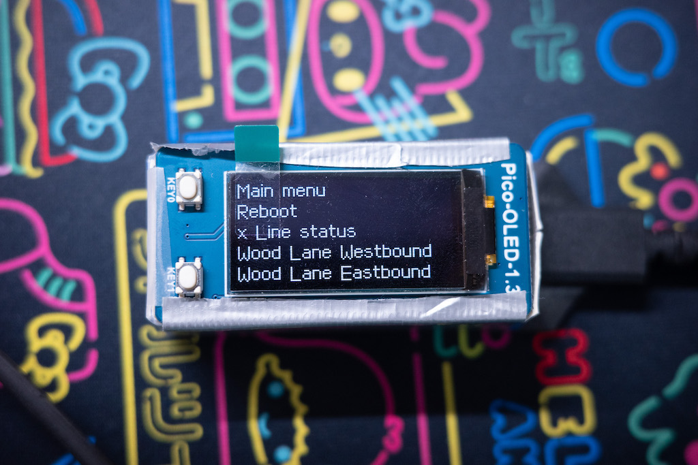
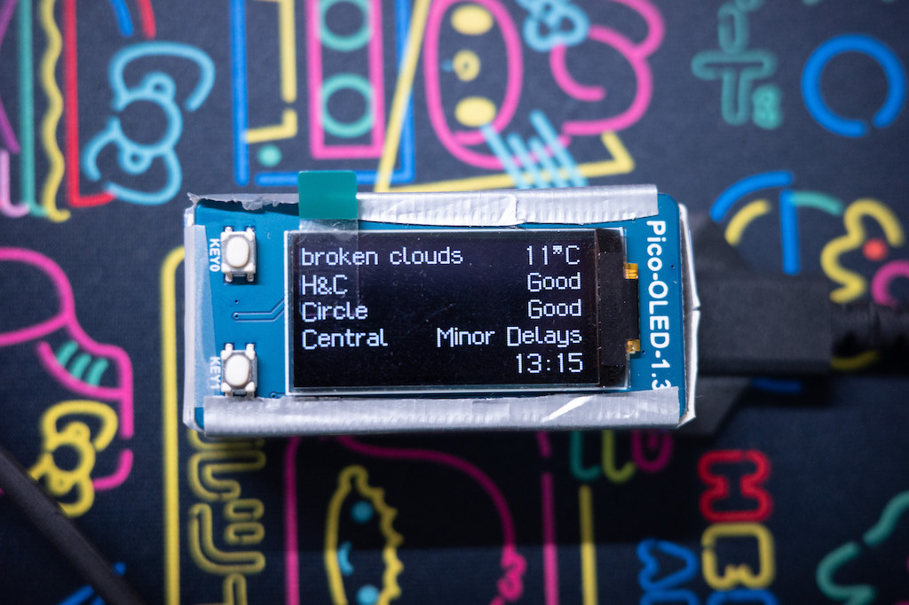
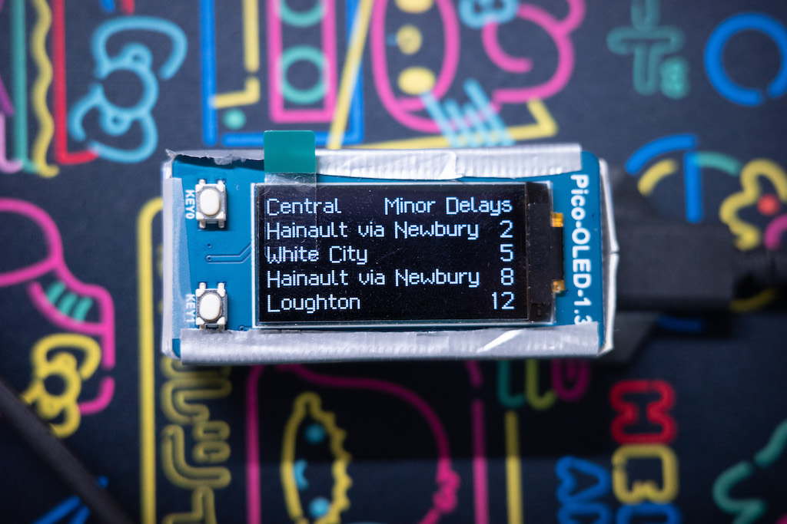

# London Underground departure board on Pico W

## Configuration
1. rename `configs.template.py` to `configs.py`
  - TFL_APP_KEY: get one from [TFL](https://api-portal.tfl.gov.uk/)
  - WEATHER_API_KEY: get one from [OpenWeather](https://openweathermap.org/api)
2. customise main menu 
  - In `main.py#L76`, main menu choices
  - For each choice, change the function parameters at `main.py#L94-116` with definitions of departure boards at `main.py#L205`

## Menu
|Interface|Controls|
|-----|-----|
||Use key0 to select and key1 to move to the next. Default to enter the current choice after waiting for 10 seconds|
||Use key0 to refresh and key1 to exit to the main menu. Automatically refresh after 30 seconds|
||Use key0 to refresh (or automatically refresh) and key 1 to exit to the main menu. Automatically refresh after 10-15 seconds ($5\times n_\mathrm{lines}$)|

## Related projects
- [framebuf2](https://github.com/peter-l5/framebuf2)
- [SH1107 display driver](https://github.com/peter-l5/SH1107)
- [micropython-font-to-py's writer.py](https://github.com/peterhinch/micropython-font-to-py/blob/master/writer/writer.py)
- [London-Underground-Dot-Matrix-Typeface](https://github.com/petykowski/London-Underground-Dot-Matrix-Typeface)